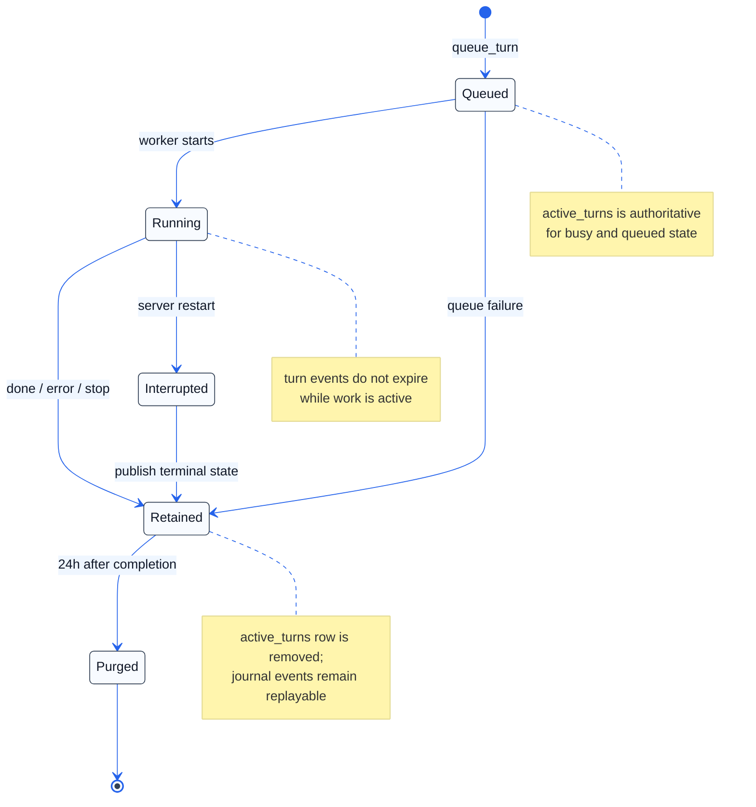

# Durable realtime chat over one SSE gateway

## Summary

This change makes the realtime event journal the durable source of truth for live chat state. Chat history remains normal persisted history, while queued/running turns and mid-turn telemetry are stored separately and delivered through one ordered SSE gateway.

As a result, refreshing during a long turn no longer loses the visible Thinking state, reconnects can replay the exact gap, and every tab viewing the same session receives new messages without waiting for a content poll.

## Why

The previous flow mixed short-lived in-memory buffers, polling, and several SSE paths. It worked while one page stayed connected, but recovery became unreliable when a request was still running during a refresh or network interruption. A second tab also had no authoritative live message feed, so it could remain stale until a refresh.

The new split is simpler:

- chat history stores durable user and assistant messages;
- `realtime_events` stores ordered browser-facing telemetry;
- `active_turns` tracks queued and running work;
- `/api/realtime/stream` is the single replay and live-delivery gateway.

## Architecture

```mermaid
%%{init: {"theme":"base","themeVariables":{"background":"#ffffff","primaryColor":"#f8fbff","primaryTextColor":"#111827","primaryBorderColor":"#334155","lineColor":"#2563eb","secondaryColor":"#eff6ff","tertiaryColor":"#ffffff","fontFamily":"Arial, sans-serif"}}}%%
flowchart LR
    subgraph Sources["Message sources"]
        WEB["🖥 Web UI<br/>Tab A · Tab B"]
        CHANNELS["💬 Telegram · WhatsApp · Discord"]
        A2A["🤖 Agent-to-agent"]
    end

    INGRESS["📥 REST + channel adapters"]
    HISTORY[("📚 Chat history<br/>messages + final answers")]

    subgraph Runtime["Agent execution"]
        QUEUE["⏳ AgentRuntime queue<br/>queued → running"]
        LOOP["⚙ LLM + tool loop"]
        BUS["🔔 EventStream"]
        PLUGINS["🧩 In-process plugin listeners"]
    end

    NORMALIZE["🛡 Public event normalizer<br/>removes local paths"]

    subgraph Durable["Durable realtime state · SQLite WAL"]
        EVENTS[("🗃 realtime_events<br/>global event_id · timestamp<br/>channel · agent · session · turn")]
        TURNS[("🔄 active_turns<br/>queued · running")]
    end

    GATEWAY["📡 GET /api/realtime/stream<br/>ordered replay + live events"]
    CLIENTS["🌐 Persistent EventSource<br/>every open tab"]

    WEB --> INGRESS
    CHANNELS --> INGRESS
    A2A --> INGRESS
    INGRESS -->|persist user message| HISTORY
    INGRESS --> QUEUE
    QUEUE -->|queue_turn / start_turn| TURNS
    QUEUE --> LOOP
    LOOP -->|persist final answer| HISTORY
    LOOP --> BUS
    BUS --> PLUGINS
    BUS --> NORMALIZE
    NORMALIZE --> EVENTS
    EVENTS --> GATEWAY
    TURNS -->|current-state snapshot| GATEWAY
    GATEWAY --> CLIENTS
    HISTORY -. "history fetch + cursor" .-> CLIENTS

    classDef box fill:#f8fbff,stroke:#334155,color:#111827,stroke-width:1.5px;
    classDef store fill:#eff6ff,stroke:#2563eb,color:#111827,stroke-width:2px;
    classDef edge fill:#ffffff,stroke:#2563eb,color:#111827,stroke-width:2px;
    class WEB,CHANNELS,A2A,INGRESS,HISTORY,QUEUE,LOOP,BUS,PLUGINS,NORMALIZE box;
    class EVENTS,TURNS store;
    class GATEWAY,CLIENTS edge;
```



The runtime still emits one internal event stream for plugins. Before listeners run asynchronously, browser-facing events are normalized and appended to SQLite with a global sequence and timestamp. The browser never receives backend paths or browser-local attachment URLs.

## Live message and cross-tab flow

```mermaid
%%{init: {"theme":"base","themeVariables":{"background":"#ffffff","primaryColor":"#f8fbff","primaryTextColor":"#111827","primaryBorderColor":"#334155","lineColor":"#2563eb","actorBkg":"#f8fbff","actorBorder":"#334155","actorTextColor":"#111827","signalColor":"#2563eb","signalTextColor":"#111827","noteBkgColor":"#fff7ed","noteBorderColor":"#f59e0b","noteTextColor":"#111827","fontFamily":"Arial, sans-serif"}}}%%
sequenceDiagram
    autonumber
    participant A as 🖥 Tab A
    participant API as 📥 Chat API
    participant H as 📚 Chat history
    participant R as ⚙ AgentRuntime
    participant E as 🔔 EventStream
    participant J as 🗃 RealtimeStore
    participant S as 📡 SSE gateway
    participant B as 🖥 Tab B

    A->>A: Render optimistic user bubble
    A->>API: POST message + client_message_id
    API->>H: Persist user message + message_id
    API->>E: emit message_received
    E->>J: append ordered public event
    J-->>S: event_id + timestamp
    S-->>A: message_received
    S-->>B: message_received
    Note over A: Match client_message_id<br/>Keep the optimistic bubble
    Note over B: Render the same message_id

    API->>R: enqueue turn
    R->>J: active_turn = queued
    R->>J: active_turn = running
    R->>E: turn_begin

    loop Reasoning and tools
        R->>E: thinking / tool_call_started / tool_executed / response_chunk
        E->>J: append next event_id
        J-->>S: ordered event
        S-->>A: update Thinking block
        S-->>B: update Thinking block
    end

    R->>H: Persist final answer + message_id
    R->>E: done
    E->>J: append terminal event
    R->>J: finish turn; retain its events for 24h
    J-->>S: done + final message_id
    S-->>A: finalize Thinking + render answer
    S-->>B: finalize Thinking + render answer
```

`client_message_id` reconciles the sender's optimistic bubble with the durable `message_received` event. `message_id` prevents the final response from being rendered twice when history, the POST response, and SSE overlap.

## Refresh and reconnect

```mermaid
%%{init: {"theme":"base","themeVariables":{"background":"#ffffff","primaryColor":"#f8fbff","primaryTextColor":"#111827","primaryBorderColor":"#334155","lineColor":"#2563eb","secondaryColor":"#eff6ff","tertiaryColor":"#ffffff","fontFamily":"Arial, sans-serif"}}}%%
flowchart LR
    REFRESH["↻ Browser refresh"]
    FETCH["📚 Fetch chat history"]
    CURSOR["🔖 Read<br/>X-Evonic-Realtime-Cursor"]
    CONNECT["🔌 Connect EventSource<br/>after=cursor"]
    SNAPSHOT["🔄 Replay active-turn snapshot"]
    GAP["🕘 Stream events<br/>event_id > cursor"]
    RESTORE["🧠 Restore the current<br/>Thinking block"]

    DROP["⚡ Temporary disconnect"]
    RECONNECT["🔌 Native EventSource reconnect"]
    LAST["🔖 Last-Event-ID"]
    REPLAY["🗃 Replay only missed rows"]
    CONTINUE["▶ Continue the same turn"]

    REFRESH --> FETCH --> CURSOR --> CONNECT --> SNAPSHOT --> GAP --> RESTORE
    DROP --> RECONNECT --> LAST --> REPLAY --> CONTINUE

    classDef step fill:#f8fbff,stroke:#334155,color:#111827,stroke-width:1.5px;
    classDef replay fill:#eff6ff,stroke:#2563eb,color:#111827,stroke-width:2px;
    class REFRESH,FETCH,CURSOR,CONNECT,DROP,RECONNECT,LAST step;
    class SNAPSHOT,GAP,RESTORE,REPLAY,CONTINUE replay;
```



A fresh page first renders stable history, then starts SSE from the cursor returned with that history. A transient disconnect is different: native `EventSource` reconnects with `Last-Event-ID`, and the gateway sends only the missing journal rows. Neither path needs content polling or a second gap-fill endpoint.

## Turn lifecycle and retention



On startup, turns owned by an old process are closed as interrupted instead of remaining permanently busy. Clearing a session removes both its active-turn projection and its realtime journal rows.

## Interface changes

- `GET /api/realtime/stream` multiplexes `chat`, `status`, `approvals`, `workplace`, and `update` events.
- Chat streams are scoped by `agent_id` and `session_id`, with replay starting from `after` or `Last-Event-ID`.
- Chat history responses expose `X-Evonic-Realtime-Cursor` so rendering history and opening SSE have a deterministic handoff.
- Message sends accept `client_message_id`; durable events include `message_id` for cross-path deduplication.
- Busy state is derived from durable queued/running turns instead of a separate in-memory agent tracker.

## Result

- Mid-turn Thinking state survives refresh and reconnect.
- New user messages appear immediately in every tab viewing the same session.
- Runtime events stay ordered by one global sequence and timestamp.
- Browser delivery no longer depends on content polling or process-local replay buffers.
- Existing plugin listeners continue to receive the internal EventStream.

## Testing

```text
./venv/bin/pytest -q \
  unit_tests/test_chat_buffer_replay.py \
  unit_tests/test_frontend_sse_lifecycle.py \
  unit_tests/test_state_changed_sse.py

17 passed
```

This covers durable ordering and scoping, active-turn recovery, history-cursor handoff, `Last-Event-ID` reconnect behavior, cross-tab delivery, optimistic deduplication, busy-state transitions, and session cleanup.
